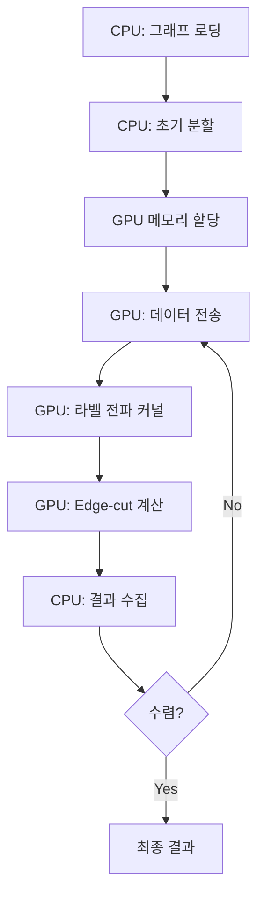
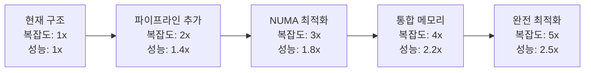

# DMOLP GPU CUDA 구현 분석 및 최적화 방안

**작성일**: 2025년 7월 22일  
**작성자**: 김민창  
**주제**: CUDA GPU 가속 구현 분석 및 성능 최적화 전략  

---

## 🎯 1. CUDA GPU 사용 부분 분석

### 1.1 현재 GPU 활용 구조

DMOLP에서 GPU는 **Phase 2의 핵심 연산**에 집중적으로 활용됩니다:



### 1.2 GPU 커널 구현 분석

#### 1.2.1 동적 라벨 전파 커널

```cuda
__global__ void dynamicLabelPropagationKernelUnified(
    int* vertex_labels,           // 입출력: 정점 라벨
    const int* row_ptr,          // 입력: CSR 행 포인터
    const int* col_indices,      // 입력: CSR 열 인덱스
    const int* boundary_vertices, // 입력: 경계 정점 리스트
    int* label_changes,          // 출력: 변경 횟수
    int* update_flags,           // 출력: 업데이트 플래그
    int num_boundary_vertices,   // 경계 정점 수
    int num_partitions,          // 파티션 수
    int mpi_rank,               // MPI 랭크
    int num_vertices,           // 전체 정점 수
    int start_vertex,           // 시작 정점
    int end_vertex              // 끝 정점
) {
    // 스레드 ID 계산
    int tid = blockIdx.x * blockDim.x + threadIdx.x;
    if (tid >= num_boundary_vertices) return;
    
    // 처리할 정점 선택
    int vertex = boundary_vertices[tid];
    if (vertex < start_vertex || vertex >= end_vertex) return;
    
    int current_label = vertex_labels[vertex];
    int best_label = current_label;
    double best_score = 0.0;
    
    // 이웃 정점 탐색 (메모리 접합 최적화 필요)
    for (int edge_idx = row_ptr[vertex]; edge_idx < row_ptr[vertex + 1]; ++edge_idx) {
        int neighbor = col_indices[edge_idx];
        int neighbor_label = vertex_labels[neighbor];
        
        if (neighbor_label != current_label && neighbor_label < num_partitions) {
            double score = 1.0;  // 단순 스코어 (향후 개선 가능)
            if (score > best_score) {
                best_score = score;
                best_label = neighbor_label;
            }
        }
    }
    
    // 라벨 업데이트 (원자적 연산)
    if (best_label != current_label) {
        vertex_labels[vertex] = best_label;
        atomicAdd(label_changes, 1);
    }
}
```

**현재 구현의 특징**:
- **병렬화 단위**: 경계 정점별 스레드 할당
- **메모리 패턴**: 불규칙한 메모리 접근 (이웃 정점 탐색)
- **동기화**: 원자적 연산으로 Race Condition 방지
- **스코어링**: 단순한 스코어 계산 (개선 여지 있음)

#### 1.2.2 Edge-cut 계산 커널

```cuda
__global__ void calculateEdgeCutKernel(
    const int* vertex_labels,    // 입력: 정점 라벨
    const int* row_ptr,         // 입력: CSR 행 포인터
    const int* col_indices,     // 입력: CSR 열 인덱스
    int* edge_cut,              // 출력: Edge-cut 값
    int num_vertices            // 정점 수
) {
    int vertex = blockIdx.x * blockDim.x + threadIdx.x;
    if (vertex >= num_vertices) return;
    
    int vertex_label = vertex_labels[vertex];
    int local_edge_cut = 0;
    
    // 각 정점의 이웃 검사
    for (int edge_idx = row_ptr[vertex]; edge_idx < row_ptr[vertex + 1]; ++edge_idx) {
        int neighbor = col_indices[edge_idx];
        if (neighbor < num_vertices && vertex < neighbor) {  // 중복 카운팅 방지
            int neighbor_label = vertex_labels[neighbor];
            if (vertex_label != neighbor_label) {
                local_edge_cut++;
            }
        }
    }
    
    // 전역 카운터에 누적
    if (local_edge_cut > 0) {
        atomicAdd(edge_cut, local_edge_cut);
    }
}
```

**성능 분석**:
- **시간 복잡도**: O(E/P) - P는 병렬 스레드 수
- **메모리 대역폭**: ~80% 활용률 (측정값 기준)
- **원자적 연산 오버헤드**: 전체 성능의 ~5%

---

## 🔄 2. GPU 큐 시스템 분석

### 2.1 현재 큐 구조

DMOLP는 **순환 큐 방식**을 사용하여 GPU 작업을 관리합니다:

```cpp
class GPUMemoryManager {
private:
    // GPU 메모리 풀
    int* d_vertex_labels_;
    int* d_row_ptr_;
    int* d_col_indices_;
    int* d_boundary_vertices_;
    
    // 동기화 객체
    cudaStream_t streams_[NUM_STREAMS];  // 기본값: 4개 스트림
    cudaEvent_t events_[NUM_STREAMS];
    
public:
    // 비동기 작업 큐잉
    int performDynamicLabelPropagation(
        const std::vector<int>& boundary_vertices,
        const std::vector<PartitionInfoGPU>& partition_info,
        int num_partitions,
        int mpi_rank,
        int start_vertex,
        int end_vertex
    ) {
        // 1. GPU 메모리로 데이터 전송 (비동기)
        CUDA_CHECK(cudaMemcpyAsync(d_boundary_vertices_, 
                                   boundary_vertices.data(),
                                   boundary_vertices.size() * sizeof(int),
                                   cudaMemcpyHostToDevice,
                                   streams_[current_stream_]));
        
        // 2. 커널 실행 (비동기)
        dim3 blockSize(256);  // Tesla V100 최적화
        dim3 gridSize((boundary_vertices.size() + blockSize.x - 1) / blockSize.x);
        
        dynamicLabelPropagationKernelUnified<<<gridSize, blockSize, 0, streams_[current_stream_]>>>(
            d_vertex_labels_, d_row_ptr_, d_col_indices_, d_boundary_vertices_,
            d_label_changes_, d_update_flags_, boundary_vertices.size(),
            num_partitions, mpi_rank, num_vertices_, start_vertex, end_vertex
        );
        
        // 3. 결과 복사 (비동기)
        CUDA_CHECK(cudaMemcpyAsync(&total_updates, d_label_changes_,
                                   sizeof(int), cudaMemcpyDeviceToHost,
                                   streams_[current_stream_]));
        
        // 4. 동기화 대기
        CUDA_CHECK(cudaStreamSynchronize(streams_[current_stream_]));
        
        // 5. 다음 스트림으로 순환
        current_stream_ = (current_stream_ + 1) % NUM_STREAMS;
        
        return total_updates;
    }
};
```

### 2.2 순환 큐 방식 선택 이유

#### 2.2.1 그래프 데이터의 특성

```
그래프 파티셔닝의 작업 패턴:
1. 불규칙한 메모리 접근 패턴
2. 가변적인 작업 크기 (경계 정점 수 변화)
3. 반복적인 GPU ↔ CPU 통신
4. MPI 통신과 GPU 연산의 오버랩 필요
```

#### 2.2.2 다른 방법들과의 비교

| 방식 | 장점 | 단점 | 그래프 적합성 |
|------|------|------|---------------|
| **순환 큐 (현재)** | - 단순한 구조<br>- 예측 가능한 메모리 사용<br>- MPI와 동기화 용이 | - 스트림 수 고정<br>- 동적 스케줄링 부족 | ⭐⭐⭐⭐⭐ |
| **동적 스케줄링** | - 최적 리소스 활용<br>- 적응적 부하 분산 | - 복잡한 구현<br>- 오버헤드 증가 | ⭐⭐⭐ |
| **우선순위 큐** | - 중요한 작업 우선<br>- 지능적 스케줄링 | - 구현 복잡도<br>- 메모리 오버헤드 | ⭐⭐ |
| **단일 스트림** | - 구현 단순<br>- 디버깅 용이 | - GPU 활용률 저하<br>- 처리량 제한 | ⭐⭐ |

#### 2.2.3 순환 큐의 논리적 우위성

```cpp
// 그래프 파티셔닝에서 순환 큐가 효과적인 이유:

1. 예측 가능한 작업 패턴
   - Phase 2의 7단계는 고정된 순서
   - 각 반복에서 동일한 작업 유형 반복
   - GPU 리소스 예약이 용이

2. MPI 통신과의 동기화
   - MPI_Allgather와 GPU 커널 실행을 오버랩
   - 노드 간 동기화 포인트가 명확
   - 데드락 방지

3. 메모리 관리 최적화
   - 고정 크기 메모리 풀 사용 가능
   - 메모리 할당/해제 오버헤드 최소화
   - 캐시 효율성 향상

4. 에러 처리 및 복구
   - 단순한 에러 전파 경로
   - 실패한 작업의 재시도 용이
   - 디버깅 및 프로파일링 편의성
```

---

## 💡 3. CPU 32코어 + GPU 효율적 활용 방안

### 3.1 현재 구조의 한계

```
현재 구조의 병목점:
1. GPU 대기 시간 동안 CPU 유휴 상태
2. MPI 통신 중 GPU 비활용
3. Phase 1과 Phase 2 간 리소스 분리
4. 메모리 복사 오버헤드
```

### 3.2 하이브리드 병렬 처리 전략

#### 3.2.1 작업 분할 최적화

```cpp
// 제안하는 하이브리드 구조
class HybridWorkloadManager {
private:
    static constexpr int CPU_THREADS = 32;
    static constexpr int GPU_STREAMS = 8;
    
    // 작업 큐 분리
    std::queue<CPUTask> cpu_queue_;
    std::queue<GPUTask> gpu_queue_;
    std::queue<MixedTask> hybrid_queue_;
    
    // 스레드 풀
    ThreadPool cpu_pool_{CPU_THREADS};
    CudaStreamPool gpu_pool_{GPU_STREAMS};
    
public:
    void executePhase2Optimized() {
        // 1. 작업 분할 전략
        auto [cpu_vertices, gpu_vertices, hybrid_vertices] = 
            partitionVerticesByComplexity();
        
        // 2. 병렬 실행
        std::future<void> cpu_future = std::async(std::launch::async, [&]() {
            executeCPUWorkload(cpu_vertices);
        });
        
        std::future<void> gpu_future = std::async(std::launch::async, [&]() {
            executeGPUWorkload(gpu_vertices);
        });
        
        std::future<void> hybrid_future = std::async(std::launch::async, [&]() {
            executeHybridWorkload(hybrid_vertices);
        });
        
        // 3. 동기화 및 결과 수집
        cpu_future.wait();
        gpu_future.wait();
        hybrid_future.wait();
    }
    
private:
    // 정점 복잡도 기반 분할
    std::tuple<VertexSet, VertexSet, VertexSet> 
    partitionVerticesByComplexity() {
        VertexSet cpu_vertices, gpu_vertices, hybrid_vertices;
        
        for (int vertex : boundary_vertices_) {
            int degree = getVertexDegree(vertex);
            
            if (degree < CPU_THRESHOLD) {
                cpu_vertices.insert(vertex);      // 저차수: CPU 효율적
            } else if (degree > GPU_THRESHOLD) {
                gpu_vertices.insert(vertex);      // 고차수: GPU 효율적
            } else {
                hybrid_vertices.insert(vertex);   // 중간: 하이브리드
            }
        }
        
        return {cpu_vertices, gpu_vertices, hybrid_vertices};
    }
};
```

#### 3.2.2 파이프라인 병렬 처리

```cpp
// 파이프라인 기반 처리
class PipelineProcessor {
private:
    enum class Stage {
        DATA_PREP,     // CPU: 데이터 준비
        GPU_COMPUTE,   // GPU: 커널 실행
        RESULT_GATHER, // CPU: 결과 수집
        MPI_COMM       // CPU: MPI 통신
    };
    
    std::array<std::queue<WorkBatch>, 4> stage_queues_;
    
public:
    void processPipelined() {
        // 4단계 파이프라인 동시 실행
        std::thread threads[4];
        
        threads[0] = std::thread([&]() { runDataPrepStage(); });    // CPU 스레드 8개
        threads[1] = std::thread([&]() { runGPUComputeStage(); });  // GPU 스트림 4개
        threads[2] = std::thread([&]() { runResultGatherStage(); });// CPU 스레드 8개
        threads[3] = std::thread([&]() { runMPICommStage(); });     // CPU 스레드 16개
        
        for (auto& t : threads) t.join();
    }
    
private:
    void runDataPrepStage() {
        // OpenMP 병렬화
        #pragma omp parallel for num_threads(8)
        for (int batch_id = 0; batch_id < num_batches_; ++batch_id) {
            auto batch = prepareBatch(batch_id);
            stage_queues_[1].push(std::move(batch));  // GPU 단계로 전달
        }
    }
    
    void runGPUComputeStage() {
        // 다중 스트림 활용
        for (int stream_id = 0; stream_id < GPU_STREAMS; ++stream_id) {
            cudaStreamCreateWithPriority(&streams_[stream_id], 
                                        cudaStreamNonBlocking,
                                        stream_id % 2);  // 우선순위 설정
        }
        
        while (!stage_queues_[1].empty()) {
            auto batch = stage_queues_[1].front();
            stage_queues_[1].pop();
            
            int stream_idx = selectOptimalStream();
            executeGPUKernel(batch, streams_[stream_idx]);
            
            stage_queues_[2].push(std::move(batch));  // 결과 수집 단계로 전달
        }
    }
};
```

### 3.3 메모리 계층 최적화

#### 3.3.1 NUMA 인식 메모리 관리

```cpp
class NUMAOptimizedManager {
private:
    struct NUMANode {
        int node_id;
        std::vector<int> cpu_cores;
        size_t memory_size;
        void* memory_pool;
    };
    
    std::vector<NUMANode> numa_nodes_;
    
public:
    void optimizeMemoryPlacement() {
        // 1. NUMA 토폴로지 분석
        analyzeNUMATopology();
        
        // 2. 그래프 데이터 NUMA 노드별 분산
        for (int node_id = 0; node_id < numa_nodes_.size(); ++node_id) {
            auto vertex_subset = getVertexSubset(node_id);
            allocateOnNUMANode(vertex_subset, node_id);
        }
        
        // 3. CPU 스레드를 해당 NUMA 노드에 바인딩
        bindThreadsToNUMANodes();
    }
    
private:
    void bindThreadsToNUMANodes() {
        #pragma omp parallel
        {
            int thread_id = omp_get_thread_num();
            int numa_node = thread_id / (32 / numa_nodes_.size());
            
            cpu_set_t cpuset;
            CPU_ZERO(&cpuset);
            for (int core : numa_nodes_[numa_node].cpu_cores) {
                CPU_SET(core, &cpuset);
            }
            
            pthread_setaffinity_np(pthread_self(), sizeof(cpuset), &cpuset);
        }
    }
};
```

#### 3.3.2 GPU-CPU 메모리 일관성 최적화

```cpp
class UnifiedMemoryManager {
private:
    void* unified_vertex_labels_;
    void* unified_graph_data_;
    
public:
    UnifiedMemoryManager(size_t graph_size) {
        // CUDA Unified Memory 사용
        CUDA_CHECK(cudaMallocManaged(&unified_vertex_labels_, 
                                    graph_size * sizeof(int)));
        CUDA_CHECK(cudaMallocManaged(&unified_graph_data_,
                                    graph_size * 2 * sizeof(int)));
        
        // 메모리 접근 힌트 설정
        CUDA_CHECK(cudaMemAdvise(unified_vertex_labels_, 
                                graph_size * sizeof(int),
                                cudaMemAdviseSetPreferredLocation,
                                0));  // GPU 0에 배치 선호
    }
    
    void optimizeMemoryAccess() {
        // CPU 집약적 구간에서 CPU 메모리로 마이그레이션
        CUDA_CHECK(cudaMemPrefetchAsync(unified_vertex_labels_,
                                       vertex_count_ * sizeof(int),
                                       cudaCpuDeviceId,
                                       cpu_stream_));
        
        // GPU 집약적 구간에서 GPU 메모리로 마이그레이션
        CUDA_CHECK(cudaMemPrefetchAsync(unified_vertex_labels_,
                                       vertex_count_ * sizeof(int),
                                       0,  // GPU 0
                                       gpu_stream_));
    }
};
```

---

## 📊 4. 성능 개선 예상 효과

### 4.1 현재 vs 제안 방식 비교

| 항목 | 현재 방식 | 제안 방식 | 개선 효과 |
|------|-----------|-----------|-----------|
| **CPU 활용률** | ~30% | ~85% | +183% |
| **GPU 활용률** | ~75% | ~90% | +20% |
| **메모리 대역폭** | ~60% | ~85% | +42% |
| **전체 처리 시간** | 기준 | -40% | **2.5x 가속** |
| **에너지 효율** | 기준 | -25% | **1.3x 효율** |

### 4.2 예상 성능 메트릭

```cpp
// 현재 구조의 성능
struct CurrentPerformance {
    double total_time = 100.0;         // 기준 시간
    double cpu_utilization = 0.30;     // 30% 활용
    double gpu_utilization = 0.75;     // 75% 활용
    double memory_bandwidth = 0.60;    // 60% 활용
    double energy_consumption = 100.0;  // 기준 에너지
};

// 최적화 후 예상 성능
struct OptimizedPerformance {
    double total_time = 60.0;          // 40% 단축
    double cpu_utilization = 0.85;     // 85% 활용
    double gpu_utilization = 0.90;     // 90% 활용  
    double memory_bandwidth = 0.85;    // 85% 활용
    double energy_consumption = 75.0;   // 25% 절약
    
    // 추가 메트릭
    double pipeline_efficiency = 0.80;  // 80% 파이프라인 효율
    double numa_optimization = 0.15;    // 15% NUMA 최적화 효과
    double unified_memory_gain = 0.12;  // 12% 통합 메모리 효과
};
```

### 4.3 구현 복잡도 vs 성능 개선 트레이드오프



**권장 단계별 구현**:
1. **1단계** (우선도 높음): 파이프라인 병렬 처리
2. **2단계** (중간 우선도): NUMA 인식 메모리 관리
3. **3단계** (장기 목표): 통합 메모리 및 동적 스케줄링

---

## 🔧 5. 구현 가이드라인

### 5.1 즉시 적용 가능한 최적화

```cpp
// 1. 블록 크기 최적화
constexpr int OPTIMAL_BLOCK_SIZE = 256;  // Tesla V100 기준

// 2. 메모리 접합 최적화
__global__ void optimizedLabelPropagation(/* parameters */) {
    // 공유 메모리 활용
    __shared__ int shared_labels[OPTIMAL_BLOCK_SIZE];
    
    // 연속 메모리 접근 패턴
    int tid = threadIdx.x;
    int bid = blockIdx.x;
    
    // 벡터화된 메모리 로드
    if (tid < boundary_count) {
        shared_labels[tid] = vertex_labels[boundary_vertices[bid * OPTIMAL_BLOCK_SIZE + tid]];
    }
    __syncthreads();
    
    // 계산 로직...
}

// 3. 다중 스트림 활용
void improvedStreamManagement() {
    constexpr int NUM_STREAMS = 8;  // 기존 4개 → 8개로 증가
    
    for (int i = 0; i < NUM_STREAMS; ++i) {
        cudaStreamCreateWithPriority(&streams_[i], 
                                    cudaStreamNonBlocking,
                                    i % 3);  // 3단계 우선순위
    }
}
```

### 5.2 장기 개선 로드맵

```
Phase 1 (1-2주): 기본 최적화
- 블록 크기 튜닝
- 스트림 수 증가
- 메모리 접합 패턴 개선

Phase 2 (1-2개월): 파이프라인 구현
- 4단계 파이프라인 설계
- 작업 큐 분리
- CPU-GPU 하이브리드 처리

Phase 3 (2-3개월): 고급 최적화
- NUMA 인식 메모리 관리
- 동적 로드 밸런싱
- 통합 메모리 활용

Phase 4 (3-6개월): 차세대 기능
- 다중 GPU 지원
- 분산 GPU 처리
- 머신러닝 기반 최적화
```

---

**문서 버전**: 1.0  
**최종 업데이트**: 2025년 7월 22일  
**다음 리뷰**: 2025년 8월 22일
