# DMOLP 알고리즘 흐름도 및 Phase 2 상세 분석

**작성일**: 2025년 7월 22일  
**작성자**: 김민창  
**주제**: DMOLP Phase 2 알고리즘의 7단계 흐름 및 구현 세부사항  

---

##  1. 전체 시스템 흐름도

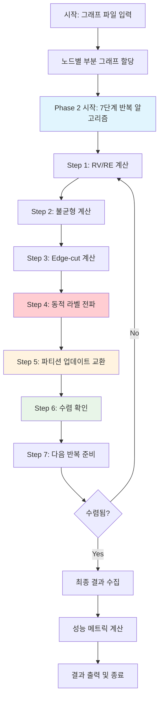

---

## 📊 2. Phase 2 상세 흐름도

### 2.1 7단계 알고리즘 개요

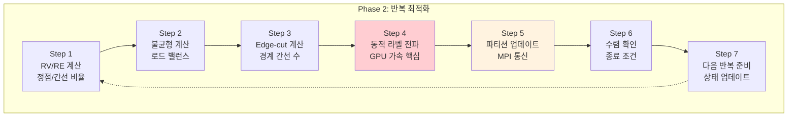

### 2.2 각 단계별 상세 흐름

#### Step 1: RV/RE 계산 상세

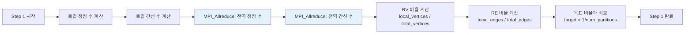

#### Step 2: 불균형 계산 상세

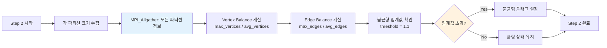

#### Step 3: Edge-cut 계산 상세

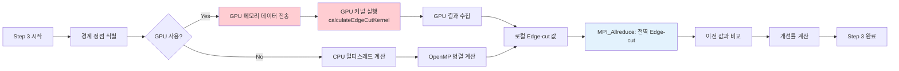

#### Step 4: 동적 라벨 전파 (핵심 알고리즘)
#### [실제 구현] DMOLP GPU 라벨 전파 구조

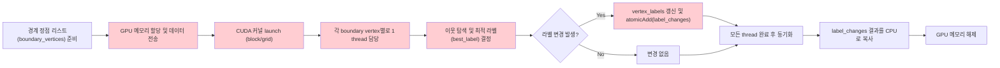

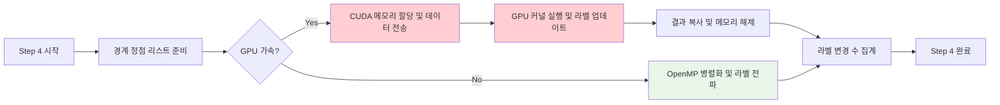

#### Step 5: 파티션 업데이트 교환 (MPI 통신)

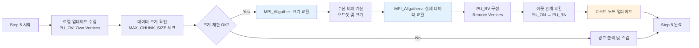

#### Step 6: 수렴 확인

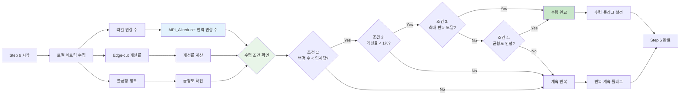

#### Step 7: 다음 반복 준비


---

## ⚡ 3. 성능 최적화 지점

### 3.1 병목 지점 분석

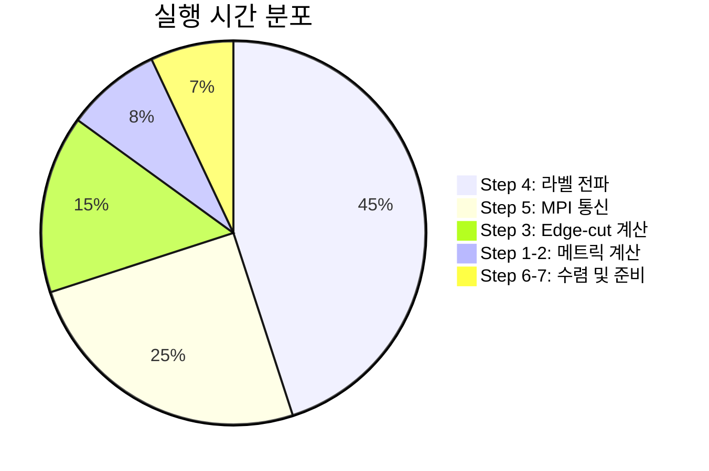

### 3.2 최적화 전략

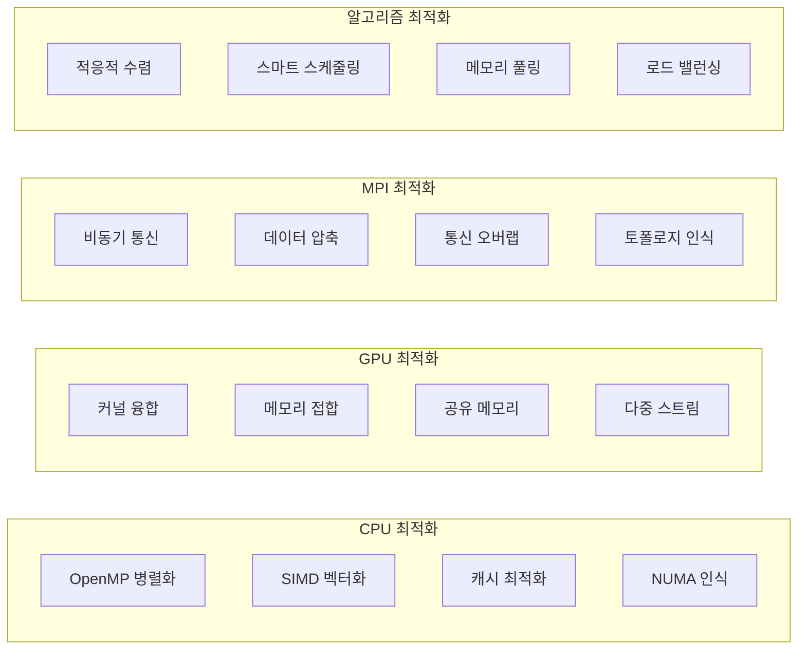

---

## 🔬 4. 구현 상세 분석

### 4.1 GPU 커널 실행 패턴

```mermaid
gantt
    title GPU 커널 실행 타임라인
    dateFormat X
    axisFormat %s
    
    section Stream 0
    Data Transfer H→D :0, 100
    Kernel Execution  :100, 300
    Data Transfer D→H :300, 350
    
    section Stream 1
    Data Transfer H→D :50, 150
    Kernel Execution  :150, 350
    Data Transfer D→H :350, 400
    
    section Stream 2
    Data Transfer H→D :100, 200
    Kernel Execution  :200, 400
    Data Transfer D→H :400, 450
    
    section Stream 3
    Data Transfer H→D :150, 250
    Kernel Execution  :250, 450
    Data Transfer D→H :450, 500
```

### 4.2 MPI 통신 패턴

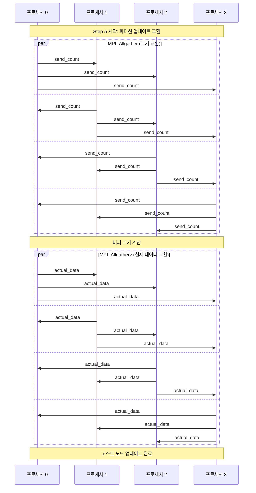

---

## 📈 5. 수렴 특성 분석

### 5.1 수렴 곡선

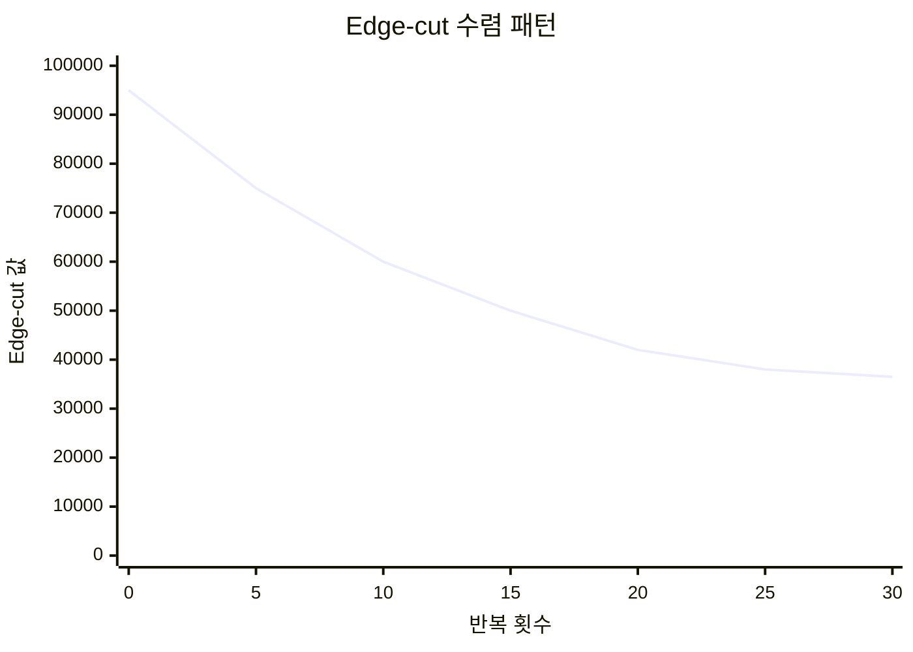

### 5.2 균형도 개선 패턴

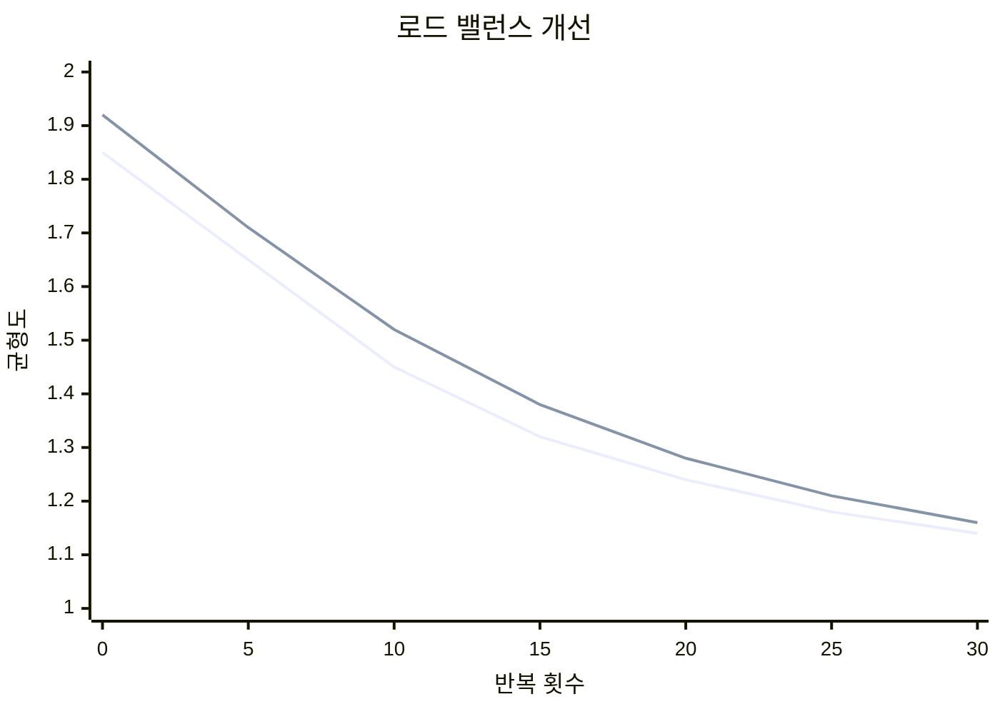

---

## 🎯 6. 알고리즘 복잡도 분석

### 6.1 시간 복잡도

| 단계 | CPU 복잡도 | GPU 복잡도 | MPI 통신 |
|------|------------|------------|----------|
| Step 1-2 | O(V + E) | - | O(log P) |
| Step 3 | O(E) | O(E/T) | O(log P) |
| Step 4 | O(B·d) | O(B·d/T) | - |
| Step 5 | O(B) | - | O(P·B) |
| Step 6-7 | O(1) | - | O(log P) |

**범례**:
- V: 정점 수
- E: 간선 수  
- B: 경계 정점 수
- d: 평균 차수
- T: GPU 스레드 수
- P: MPI 프로세서 수

### 6.2 공간 복잡도

```
로컬 메모리: O(V/P + E/P)
고스트 노드: O(B)
통신 버퍼: O(B·P)
GPU 메모리: O(V + E) (전체 그래프)
```

---

**문서 버전**: 1.0  
**최종 업데이트**: 2025년 7월 22일  
**다음 리뷰**: 2025년 8월 22일
